# LLM Chatbot Augmented with Enterprise Data 

This repository demonstrates how to use an open source pre-trained instruction-following LLM (Large Language Model) to build a ChatBot-like web application. 
The responses of the LLM are enhanced by giving it context from an internal knowledge base. This context is retrieved by using an open source Vector Database to do semantic search. 

Watch the Chatbot in action [here](https://www.youtube.com/watch?v=WBH9hYDyHKU).


All the components of the application (knowledge base, context retrieval, prompt enhancement LLM) are running within CML. This application does not call any external model APIs nor require any additional training of an LLM. 
The knowledge base provided in this repository is a slice of the Cloudera Machine Learning documentation.

> **IMPORTANT**: Please read the following before proceeding.  By configuring and launching this project, you will cause h2oai/h2ogpt-oig-oasst1-512-6.9b, which is a third party large language model (LLM), to be downloaded and installed into your environment from the third party’s website.  Please see https://huggingface.co/h2oai/h2ogpt-oig-oasst1-512-6.9b for more information about the LLM, including the applicable license terms.
If you do not wish to download and install h2oai/h2ogpt-oig-oasst1-512-6.9b, do not deploy this repository.  By deploying this repository, you acknowledge the foregoing statement and agree that Cloudera is not responsible or liable in any way for h2oai/h2ogpt-oig-oasst1-512-6.9b. Author: Cloudera Inc.

## Table of Contents  
#### LABS
* Lab 0 - Session resources validation
* Lab 1 - Install dependancies
* Lab 2 - Download models
* Lab 3 - Populate vector database
* Lab 4 - Build the app
* Lab 5 - Serve model

#### README
* [Enhancing Chatbot with Enterprise Context to reduce hallucination](#enhancing-chatbot-with-enterprise-context-to-reduce-hallucination)
  * [Retrieval Augmented Generation (RAG) Architecture](#retrieval-augmented-generation--rag--architecture)
* [Requirements](#requirements)
* [Project Structure](#project-structure)
  * [Implementation](#implementation)
* [Technologies Used](#technologies-used)

#### GUIDES
* [Customization](guides/customization.md)
    * [Knowledgebase](guides/customization.md#knowledgebase)
    * [Models](guides/customization.md#Model)
* [Troubleshooting](guides/troubleshooting.md)
    * [AMP Failures](guides/troubleshooting.md#amp-failures)
    * [Limitations](guides/troubleshooting.md#limitations)


# LABS
*Deploying on CML*  
To build this project from source code without automatic execution of project setup, you should follow the steps listed carefully and in order.

## Project Build Process

The following step-by-step instructions correspond to the project files in this directory and should be followed in sequential order.
- Create a project (by forking an existing one in the CML workspace)  
- Add required Runtimes  
  
### Creating a Project
There are various ways to be creating a project.
Because of the size of the models we'll be using in this lab, please fork the "MASTER" project in the workspace.
  
![forkproject1.png] (./images/forkproject1.png)
 

**FOR REFERENCE ONLY** Below is the how to to clone a git repository. 
The first step for the second part of the lab will be to create another project within CML using another git repo as a starting point. For this you will need to:

 1. In a CML workspace, click **New Project**, add a Project Name (we recommend adding your user to avoid having duplicate names), and a description
 2. Select Git as the Initial Setup option and add the repo URL: https://github.com/nhernandezdlm/CML_LLM_Chatbot_Augmented_with_Ent_Data.git
 3. Select Runtime setup **Basic**, Python 3.9 kernel.
 4. Tick on the **Add GPU enabled Runtime variant**
 5. Click **Create Project**
 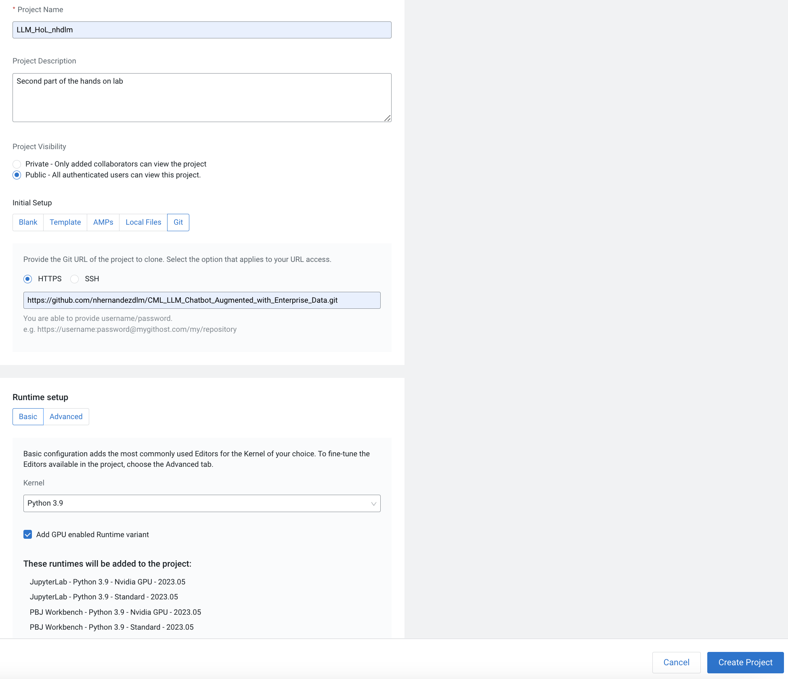

### Add Runtimes
For the purpose of running the code, make sure you have the appropriate runtimes available in your project:
You can think of an ML Runtime as a virtual machine, customized to have all the necessary dependencies to access the computing cluster while keeping each project’s environment entirely isolated. To ensure that every ML Runtime has access to the parcels and client configuration managed by the Cloudera Manager Agent, a number of folders are mounted from the host into the container environment.
  
ML Runtimes have been open sourced and are available in the cloudera/ml-runtimes GitHub repository. If you need to understand your Runtime environments fully or want to build a new Runtime from scratch, you can access the Dockerfiles that were used to build the ML Runtime container images in this repository.
  
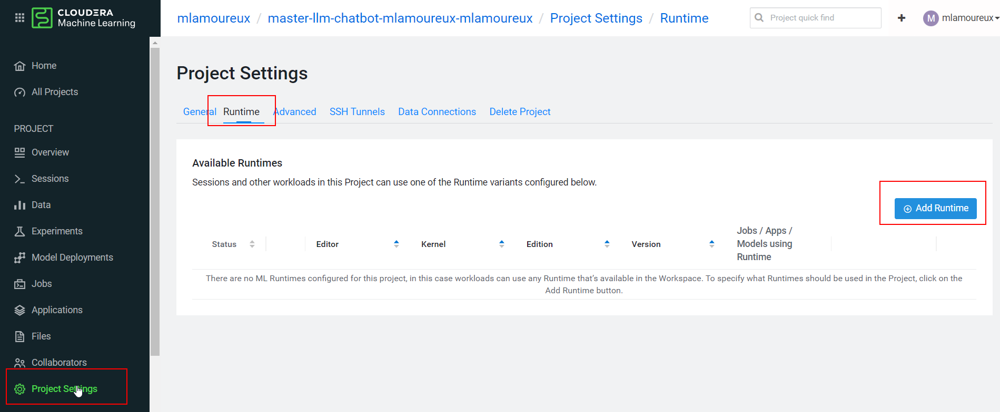

For this project, we'll need the NVIDIA version of a workbench and a jupyter runtimes using python 3.9, with all the packages and dependency deployed on the image to manage GPUs.
  
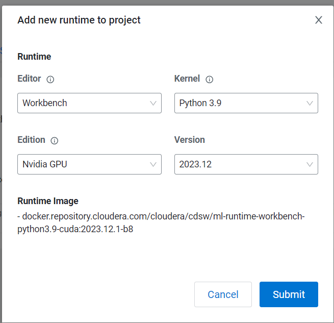 

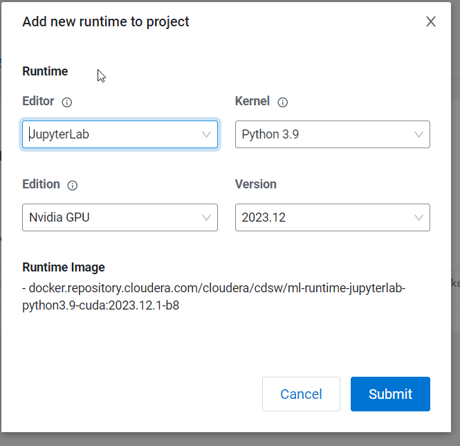  
  
  
### 0_session-resource-validation
Before starting the project, a GPU resource validation needs to happen. 

For this you will need to create a session (this session will be used on the next step - installing the dependencies as well). Follow these steps:
1. Go to Sessions --> **New Session**
2. Select **Workbench** for the Editor and **Python 3.9** for the Kernel, and Edition **Nvidia GPU**
3. You must select 1 GPU from the **Resource Profile**. 
4. Create session
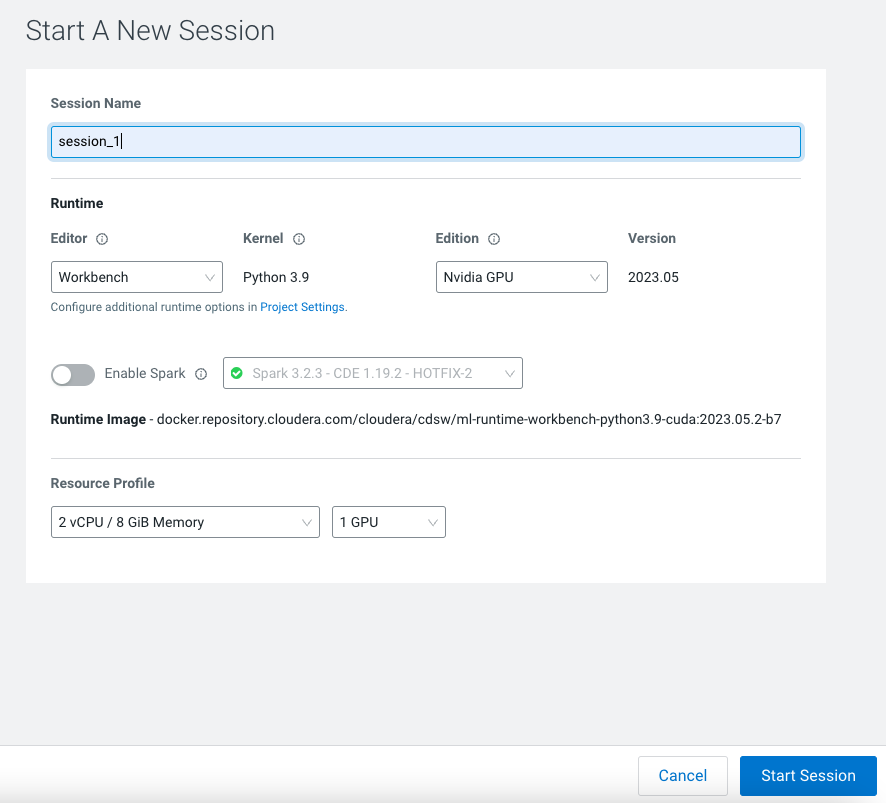

Make sure the session has 4vCPU and 32GiB of memory at least for this script.
Once the session is running,open the `0_0_check_gpu_capability.py` script, then click **Run > Run All**.
Repeteat the same process with the `0_1_check_gpu_resources.py` script. This will do the initial checks.


### 1. session-install-deps
To install the dependencies for this project, you will need to run the script `code/1_session-install-deps/install_dependencies.py` by opening the script and clicking **Run > Run All**. This will install the python dependencies specified in `code/1_session-install-deps/requirements.txt`

### 2. Download-models - DNU
**Because this takes a little bit of time to run, the models were already downloaded for the purpose of this lab.**
To download the models we will schedule a job that will directly download specified models from the huggingface repositories. These are pulled to new directories `models/llm-model` and `models/embedding-model`. 
To create a new job, go to **Jobs > New Job** (in the left side bar) and enter the following settings:

* **Name**: Download Models
* **Script**:code/2_job-download-models/download_models.py
* **Arguments**:Leave blank
* **Kernel**: Python 3
* **Schedule**: Manual
* **Engine Profile**: 4 vCPU / 32 GiB Memory

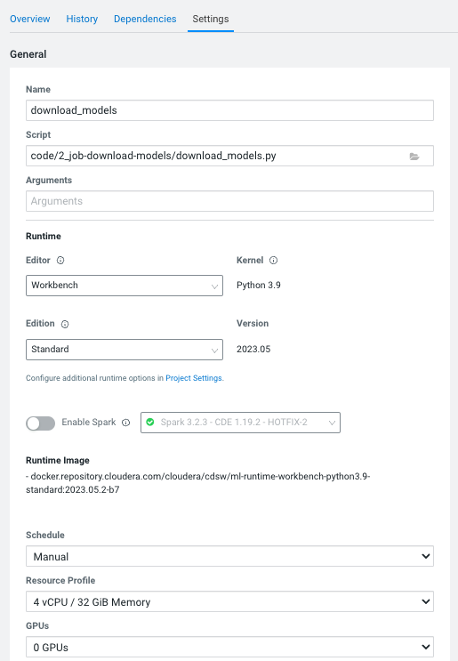

### 3. Populate vectorDB
In this step we will:
- Start a milvus vector database and set database to be persisted in new directory `milvus-data/`
- Generate embeddings for each document in `data/`
- The embeddings vector for each document will be inserted into the vector database
- Finally stop the vector database

We will be using a Jupyter Notebook. For this, we need to start a **New Session** using Jupyterlab 4 vCPU / 32 GiB Memory and open the `code/3_job_ipynb-populate-vectordb/vectordb_insert.ipynb` file.

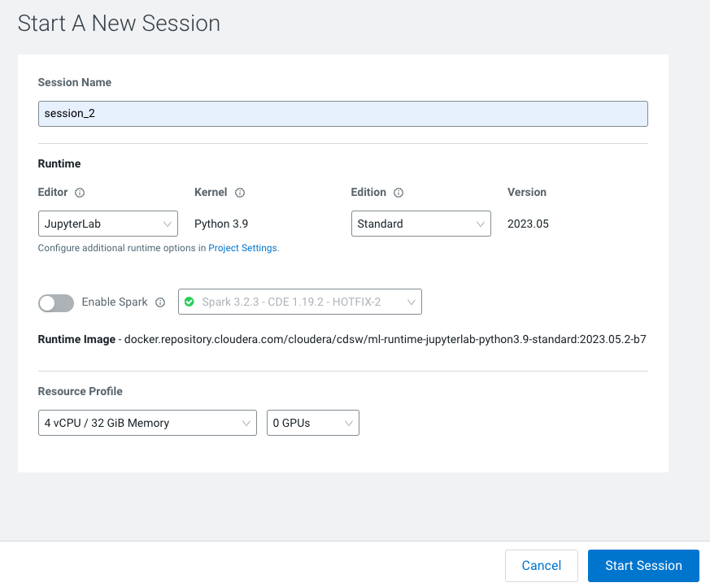

_Note: You can also schedule a job for this step, for that you will follow the same steps as the previous point and add the `code/3_job_ipynb-populate-vectordb/vectordb_insert.py` script._


### 4. app
The last step of our lab will be focused on creating an application where we we will have a chat interface that performs both retrieval-augmented LLM generation and regular LLM generation for bot responses.

To create the application go to **Applications** > **New Application** with the following details: 
* **Name**: CML LLM Chatbot
* **Subdomain**: llmApp`<yourname>` _(note: this needs to be unique, so if you've done this before, 
  pick a more random subdomain name)_
* **Description**: _optional_
* **Allow Unauthenticated Access**: tick box
* **Script**: code/4_app/llm_rag_app.py
* **Runtime**: Workbench Python 3.9
* **Edition**: Nvidia GPU
* **Engine Profile**: 8vCPU / 64 GiB Memory
* **Enable Spark toggle**: No
* **GPUs**: 1 GPU

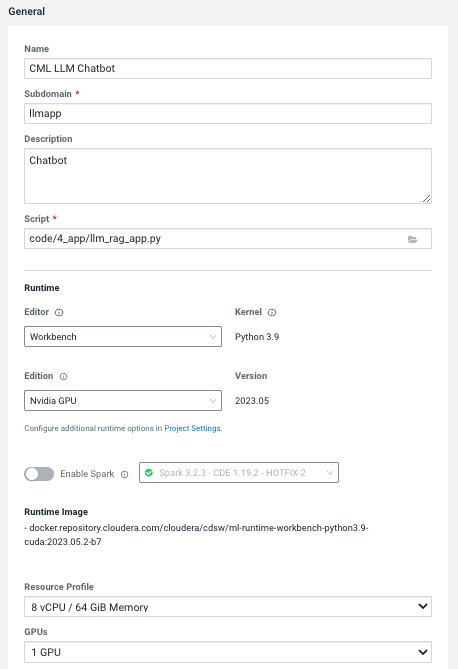  
  
## CML LLM Chatbot
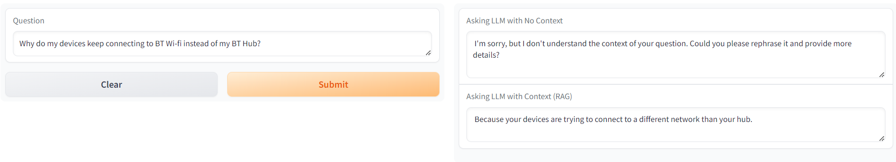
  
   
### 5. Model
Deploying a model here will allow us to send requests to our bot in the form of prompt and have it send the answer back using a REST API.
It referes a function within a R or python file: The function to be invoked inside the file. This function should take a single JSONencoded object (for example, a python dictionary) 
as input and return a JSON-encodable object as output to ensure compatibility with any 
application accessing the model using the API. JSON decoding and encoding for model 
input/output is built into Cloudera Machine Learning.

Models can be deployed in a matter of clicks, removing any roadblocks to production. 
They are served as REST endpoints in a high availability manner,
with automated lineage building and metric tracking for MLOps purposes.

From the Project Overview, click "New Model".  
  

In the configuration window for you model indicate:
* **Deploy model from code**
* **Name**: Chatbot as a model - User<xx>
* **Description**: Chatbot as a model
* **Enable Authentication**:Untick
* **File**: code/5_model/model.py
* **Function Name**:get_responses
* **Example Input**:
`
{"prompt":"What does a blue light mean on my BT device?"}
`
* **Runtime**: Workbench Python 3.9
* **Edition**: Nvidia GPU
* **Engine Profile**: 1vCPU / 2 GiB Memory
* **Enable Spark toggle**: No
* **GPUs**: 1 GPU
* **Replicas**: 1


The **[Models](https://docs.cloudera.com/machine-learning/cloud/models/topics/ml-creating-and-deploying-a-model.html)** 
is used to deploy a machine learning model into production for real-time prediction. 

How to deploy a generic model  
* **Step 1** - Writing in python the function for the model.  
Example function:  
```python
# == Main Function ==
def PredictFunc(args):
	# Get Prediction
	prediction = model.predict(arg)
	# Return Prediction
	return prediction
```  
* **Step 2** - Add requirements for model container:  
- you need a requirements.txt file  
- you need a cdsw-build.sh with the pip install for the requirements file.  

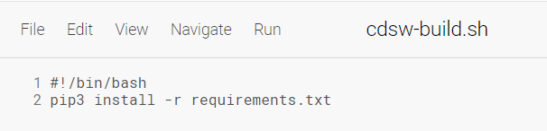  
* **Step 3** - Create the model under the "model" tab and indicate the arguments as input in a json format, based on the arguments of the python function.

**In python:**    
`arg = "Example question of your choice"`  


**In the model form:**  
`{
  "prompt":"Example question of your choice"
}`  

Leave the rest unchanged. Click **Deploy Model** and the model will go through the build 
process and deploy a REST endpoint. Once the model is deployed, you can test it is working 
from the Model Overview page.

_**Note: This is important**_

Once the model is deployed, you must disable the additional model authentication feature.
In the model settings page, untick **Enable Authentication**.

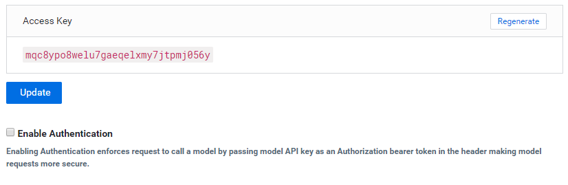


## Enhancing Chatbot with Enterprise Context to reduce hallucination

When a user question is directly sent to the open-source LLM, there is increased potential for halliucinated responses based on the generic dataset the LLM was trained on. By enhancing the user input with context retrieved from a knowledge base, the LLM can more readily generate a response with factual content. This is a form of Retrieval Augmented Generation.

For more detailed description of architectures like this and how it can enhance NLP tasks see this paper: [Retrieval-Augmented Generation for Knowledge-Intensive NLP Tasks
](https://arxiv.org/abs/2005.11401)

### Retrieval Augmented Generation (RAG) Architecture
- Knowledge base Ingest into Vector Database
  - Given a local directory of proprietary data files (in this example 1000 contracts for College Student Credit Cards in the USA)
  - Generate embeddings with an open sourced pretrained model for each of those files
  - Store those embeddings along with document IDs in a Vector Database to enable semantic search
- Augmenting User Question with Additional Context from Knowledge Base
  - Given user question, search the Vector Database for documents that are semantically closest based on embeddings
  - Retrieve context based on document IDs and embeddings returned in the search response
- Submit Enhanced prompt to LLM to generate a factual response
  - Create a prompt including the retrieved context and the user question
  - Return the LLM response in a web application

## Requirements
#### CML Instance Types
- A GPU instance is required to perform inference on the LLM
  - [CML Documentation: GPUs](https://docs.cloudera.com/machine-learning/cloud/gpu/topics/ml-gpu.html)
- A CUDA 5.0+ capable GPU instance type is recommended
  - The torch libraries in this AMP require a GPU with CUDA compute capability 5.0 or higher. (i.e. nVidia V100, A100, T4 GPUs)

#### Resource Requirements
This AMP creates the following workloads with resource requirements:
- CML Session: `4 CPU, 32B MEM`
- CML Jobs: `4 CPU, 32GB MEM`
- CML Application: `8 CPU, 1 GPU, 64GB MEM`

#### External Resources
This AMP requires pip packages and models from huggingface. Depending on your CML networking setup, you may need to whitelist some domains:
- pypi.python.org
- pypi.org
- pythonhosted.org
- huggingface.co

## Project Structure
### Folder Structure

The project is organized with the following folder structure:
```
.
├── code/                                 # Backend scripts needed to create project artifacts
      ├───0_session-resource-validation/  # Script for checking CML workspace reqs
      ├───1_session-install-deps/         # Script for installing python dependencies
      ├───2_job-download-models/          # Scripts for downloading pre-trained models
      ├───3_job-populate-vectordb/        # Scripts for init and pop a vector db with context
      ├───4_app/                          # Scripts for app and the reqs for the models
      ├───5_models/                       # Scripts for serving model    
      ├───utils/                          # Python module for functions used in the project
├── data/                                 # Sample documents to use to context retrieval
├── images/
├── README.md
└── LICENSE.txt
```
## Data
The `data`  directory stores all the individual sample documents that are used for context retrieval in the chatbot application
- Sourced from the British Telecommunication Self Help website, with 3 different how-to on trouble shooting Broadband were uploaded.
- Because of the configuration of the models and compute resources and the vector database, files should be smaller than 500 words and not contain any return lines.

## Technologies Used
#### Open-Source Models and Utilities
- [all-MiniLM-L12-v2](https://huggingface.co/sentence-transformers/all-MiniLM-L12-v2/tree/9e16800aed25dbd1a96dfa6949c68c4d81d5dded)
     - Vector Embeddings Generation Model
- [h2ogpt-oig-oasst1-512-6.9b](https://huggingface.co/h2oai/h2ogpt-oig-oasst1-512-6.9b/tree/4e336d947ee37d99f2af735d11c4a863c74f8541)
   - Instruction-following Large Language Model
- [Hugging Face transformers library](https://pypi.org/project/transformers/)
#### Vector Database
- [Milvus](https://github.com/milvus-io/milvus)
#### Chat Frontend
- [Gradio](https://github.com/gradio-app/gradio)
