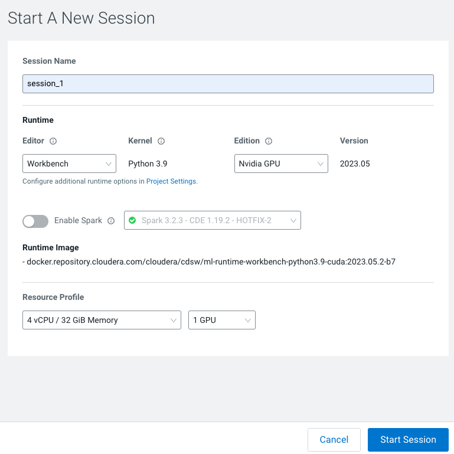
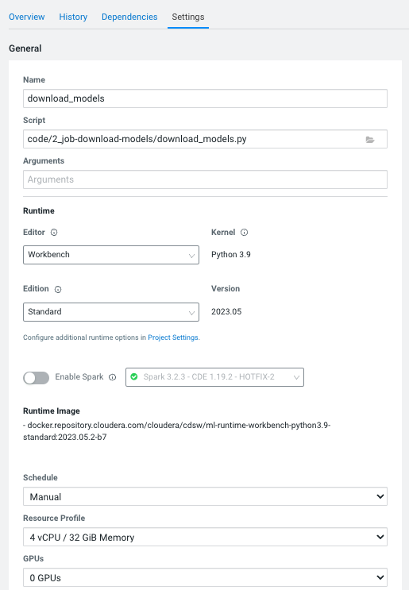
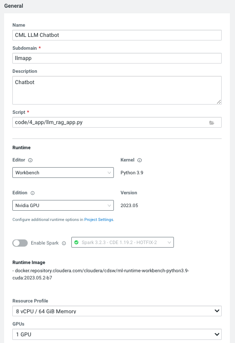

# Project Build Process

The following step-by-step instructions correspond to the project files in this directory and should be followed in sequential order.

## Creating a Project
The first step for the second part of the lab will be to create another project within CML using another git repo as a starting point. For this you will need to:

 1. In a CML workspace, click **New Project**, add a Project Name (we recommend adding your user to avoid having duplicate names), and a description
 2. Select Git as the Initial Setup option and add the repo URL: https://github.com/nhernandezdlm/CML_LLM_Chatbot_Augmented_with_Ent_Data.git
 3. Select Runtime setup **Basic**, Python 3.9 kernel.
 4. Tick on the **Add GPU enabled Runtime variant**
 5. Click **Create Project**
 

## 0_session-resource-validation
Before starting the project, a GPU resource validation needs to happen. 

For this you will need to create a session (this session will be used on the next step - installing the dependencies as well). Follow these steps:
1. Go to Sessions --> **New Session**
2. Select **Workbench** for the Editor and **Python 3.9** for the Kernel, and Edition **Nvidia GPU**
3. You must select 1 GPU from the **Resource Profile**. 
4. Create session

Once the session is running,open the `check_gpu_capability.py` script, then click **Run > Run All**.
Repeteat the same process with the `check_gpu_resources.py` script. This will do the initial checks.

## 1_session-install-deps
To install the dependencies for this project, you will need to run the script `code/1_session-install-deps/install_dependencies.py` by opening the script and clicking **Run > Run All**. this will install the python dependencies specified in `code/1_session-install-deps/requirements.txt`

## 2_job-download-models
To download the models we will schedule a job that will directly download specified models from the huggingface repositories. These are pulled to new directories `models/llm-model` and `models/embedding-model`. 
To create a new job, go to **Jobs > New Job** (in the left side bar) and enter the following settings:

* **Name**: Download Models
* **Script**:code/2_job-download-models/download_models.py
* **Arguments**:Leave blank
* **Kernel**: Python 3
* **Schedule**: Manual
* **Engine Profile**: 2 vCPU / 8 GiB Memory

## 3_job-populate-vectordb
In this step we will:
- Start a milvus vector database and set database to be persisted in new directory `milvus-data/`
- Generate embeddings for each document in `data/`
- The embeddings vector for each document will be inserted into the vector database
- Finally stop the vector database

We will be using a Jupyter Notebook. For this, we need to start a **New Session** using Jupyterlab 2 vCPU / 8 GiB Memory and open the `code/3_job_ipynb-populate-vectordb/vectordb_insert.ipynb` file.

_Note: You can also schedule a job for this step, for that you will follow the same steps as the previous point and add the `code/3_job_ipynb-populate-vectordb/vectordb_insert.py` script._

## 4_app
The last step of our lab will be focused on creating an application where we we will have a chat interface that performs both retrieval-augmented LLM generation and regular LLM generation for bot responses.

To create the application go to **Applications** > **New Application** with the following details: 
* **Name**: CML LLM Chatbot
* **Subdomain**: llmApp _(note: this needs to be unique, so if you've done this before, 
  pick a more random subdomain name)_
* **Script**: code/4_app/llm_rag_app.py
* **Kernel**: Python 3
* **Edition**: Nvidia GPU
* **Engine Profile**: 2vCPU / 16 GiB Memory
* **Enable Spark toggle**: No
* **GPUs**: 1 GPU

