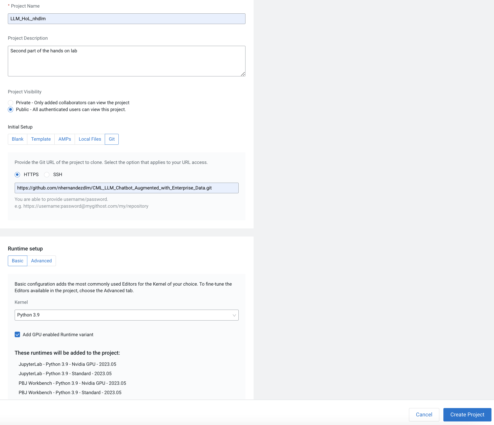

# Project Build Process

The following step-by-step instructions correspond to the project files in this directory and should be followed in sequential order.

## Creating a Project
The first step for the second part of the lab will be to create another project within CML using another git repo as a starting point. For this you will need to:

 1. In a CML workspace, click **New Project**, add a Project Name (we recommend adding your user to avoid having duplicate names), and a description
 2. Select Git as the Initial Setup option and add the repo URL: https://github.com/nhernandezdlm/CML_LLM_Chatbot_Augmented_with_Enterprise_Data.git
 3. Select Runtime setup **Basic**, Python 3.9 kernel.
 4. Tick on the **Add GPU enabled Runtime variant**
 5. Click **Create Project**
 

## 0_session-resource-validation
Before starting the project, a GPU resource validation needs to happen. For this you will need to open the files `check_gpu_capability.py` and `check_gpu_resources.py` in a normal workbench Python3 session. You must select 1 GPU from the **Resource Profile**. Once the session is loaded, click **Run > Run All**. This will do the initial checks.

## 1_session-install-deps
- Install python dependencies specified in 1_session-install-deps/requirements.txt

## 2_job-download-models
Definition of the job **Download Models** 
- Directly download specified models from huggingface repositories
- These are pulled to new directories models/llm-model and models/embedding-model

## 3_job-populate-vectordb
Definition of the job **Populate Vector DB with documents embeddings**
- Start the milvus vector database and set database to be persisted in new directory milvus-data/
- Generate embeddings for each document in data/
- The embeddings vector for each document is inserted into the vector database
- Stop the vector database

## 4_app
Definition of the application `CML LLM Chatbot`
- Start the milvus vector database using persisted database data in milvus-data/
- Load locally persisted pre-trained models from models/llm-model and models/embedding-model 
- Start gradio interface 
- The chat interface performs both retrieval-augmented LLM generation and regular LLM generation for bot responses.

